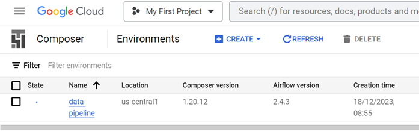
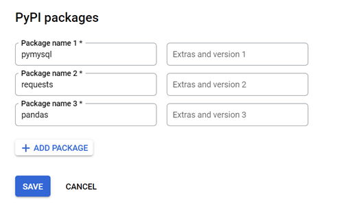
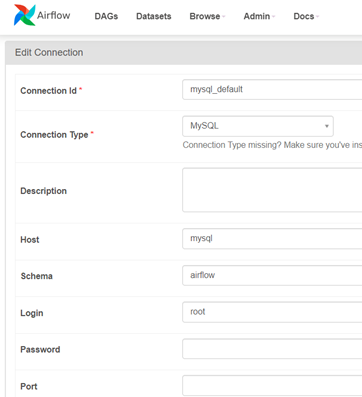
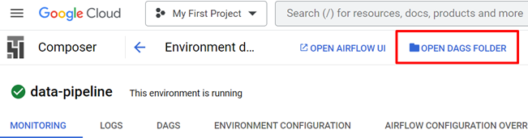
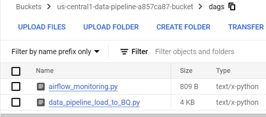
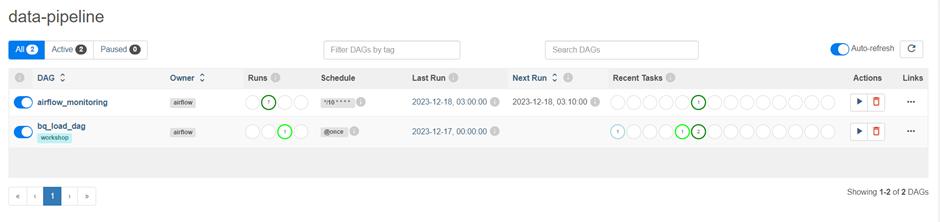
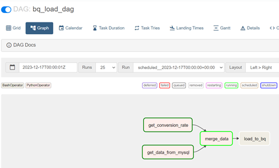
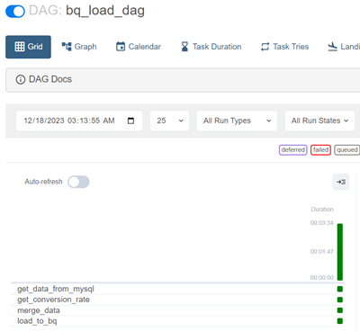
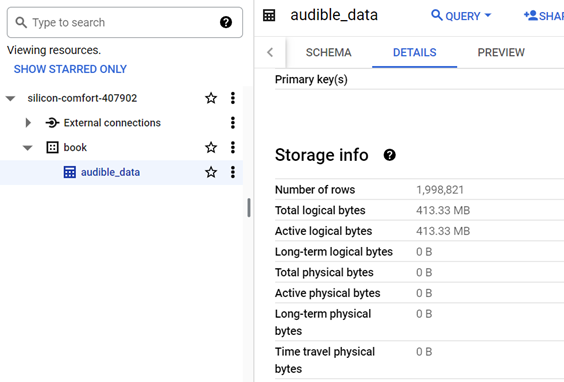

# Data Pipeline by Airfolw

Step 1) Create Composer

 
Step 2 ) Insert Packages

 
Step 3 ) Set Connection in Airflow(MySQL)

 
Step 4 ) Upload data_pipe.py file to gs://…/dags in GCS.

Step 5 ) Check in Airflow

Step 6 ) Check in BQ

